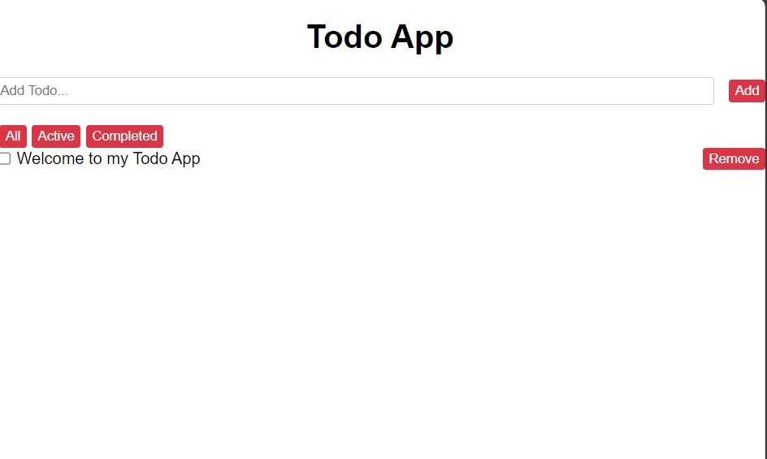

# Todo App

This is a simple todo app created using React. It allows users to add, toggle, and remove todo items.

## Features

- Add new todo items
- Mark todo items as completed
- Remove todo items
- Filter todo items by all, active, and completed

## Technologies Used

- React
- JavaScript
- HTML/CSS

## Getting Started

To run this app locally, follow these steps:

1. Clone the repository: `git clone https://github.com/Deadsec19/todo-app.git`
2. Navigate to the project directory: `cd todo-app`
3. Install dependencies: `npm install`
4. Run the app: `npm start`
5. Open [http://localhost:3000](http://localhost:3000) in your browser to view the app.

## License

This project is licensed under the MIT License - see the [LICENSE](LICENSE) file for details.

## Deployed Version

[Live Demo](https://todomaster-9000.netlify.app/)
